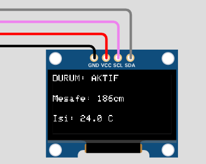
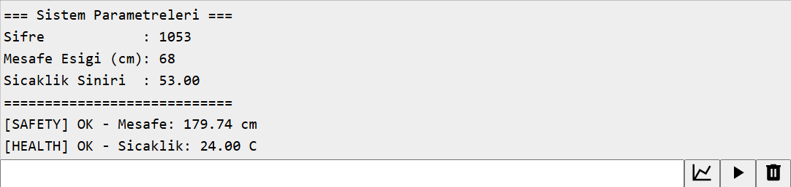
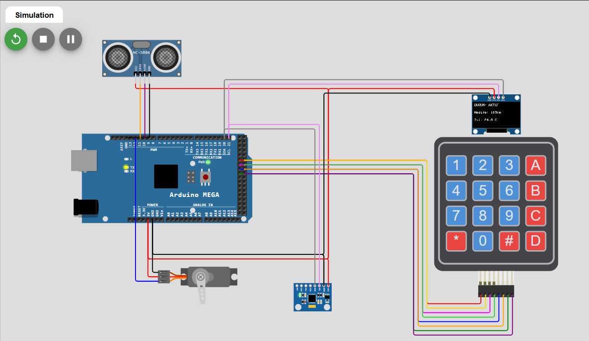
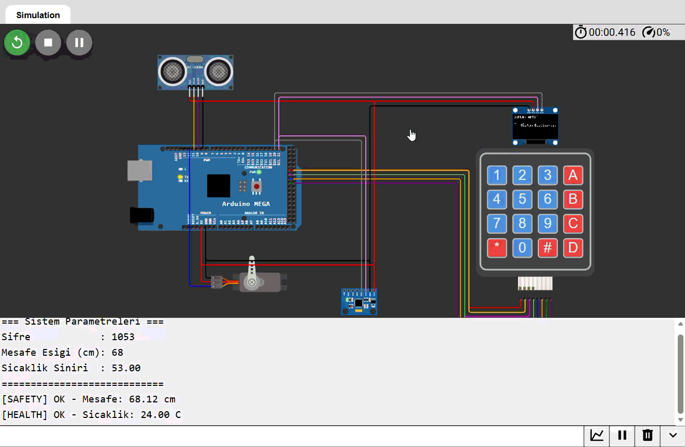

<div align="center">

# 🦾 FreeRTOS Robotic Arm Controller

**Real-time industrial robotic arm simulation — built on Arduino Mega 2560, FreeRTOS, and Wokwi**

[](https://www.arduino.cc/)
[](https://www.freertos.org/)
[](https://wokwi.com/projects/463008960385179649)
[](https://www.arduino.cc/)
[]()

<br/>

> *A multitasking embedded system that simulates an industrial robotic arm — featuring safety interlocks, health monitoring, keypad authentication, and real-time OLED feedback. All tasks run concurrently without blocking each other.*

<br/>

[](https://wokwi.com/projects/463008960385179649)

</div>

An embedded systems project built on Arduino Mega 2560 with FreeRTOS, simulating an industrial robotic arm scenario. Four independent tasks run concurrently: proximity-based safety lock, temperature monitoring, servo arm motion, and an OLED + keypad interface. No `delay()` calls anywhere — `vTaskDelay()` yields CPU time back to the scheduler so no task ever blocks another.

On top of that, both the OLED and MPU6050 share the same I²C bus. A `mutex` prevents them from stepping on each other — a small but important detail that makes the system behave correctly under real concurrent access.

---

## ✨ Features

| Feature | Description |
|---|---|
| **FreeRTOS Multitasking** | 4 independent tasks managed by a priority-based preemptive scheduler |
| **Safety Lock** | HC-SR04 locks the arm when distance drops below threshold; only unlocked via password |
| **Temperature Monitoring** | MPU6050 onboard sensor tracks thermal state; triggers FAULT MODE on overheat |
| **Servo Arm Motion** | Non-blocking 0°–180° sweep via dedicated task |
| **OLED System Panel** | SSD1306 128×64 displays live mode, distance, and temperature |
| **Password Authentication** | 4×4 keypad unlock with 2-second wrong-password feedback |
| **I²C Mutex Protection** | OLED and MPU6050 share the bus safely via `xSemaphoreTake/Give` |
| **Serial Debug Output** | Structured per-task logs at 115200 baud |

---

## 🔧 Hardware

| Component | Connection |
|---|---|
| Arduino Mega 2560 | — |
| HC-SR04 Ultrasonic Sensor | Trig → GPIO 11, Echo → GPIO 10 |
| MPU6050 IMU | SDA → GPIO 20, SCL → GPIO 21 (I²C) |
| SSD1306 OLED 128×64 | SDA → GPIO 20, SCL → GPIO 21 (I²C) |
| Servo Motor | PWM → GPIO 12 |
| 4×4 Membrane Keypad | Rows → GPIO 30–33, Cols → GPIO 34–37 |

---

## 📚 Libraries Used

| Library | Purpose |
|---|---|
| `Arduino_FreeRTOS` | RTOS kernel and scheduler |
| `semphr.h` | Mutex / semaphore API |
| `Wire` | I²C communication bus |
| `Adafruit_GFX` | Graphics abstraction layer |
| `Adafruit_SSD1306` | OLED display driver |
| `Adafruit_MPU6050` | IMU sensor interface |
| `Adafruit_Sensor` | Unified sensor abstraction |
| `Keypad` | Matrix keypad scanning |
| `Servo` | PWM servo motor control |

---

## 🔑 Personalization Parameters

The following constants can be adjusted at the top of `sketch.ino`:

```cpp
const char* RESET_PASSWORD     = "1053";  // Your own 4-digit code
const int   DISTANCE_THRESHOLD = 68;      // Lock trigger distance (cm)
const float TEMP_LIMIT         = 53.0;    // Overheat threshold (°C)
```

---

## 🚀 How to Run

### Option A — Wokwi (Recommended)

Open the project directly and hit play — no hardware needed:

**https://wokwi.com/projects/463008960385179649**

▶ Press **Start Simulation**. Open the **Serial Monitor** tab at the bottom left to follow task output.

### Option B — Wokwi (From Files)

1. [wokwi.com](https://wokwi.com) → **New Project → Arduino Mega**
2. Paste `sketch.ino` into the code editor
3. Paste `diagram.json` into the **Diagram** tab
4. Paste `libraries.txt` into the **Libraries** tab
5. ▶ **Start Simulation**

---

## ⚙️ How It Works

On boot, hardware is initialized, the I²C mutex is created, and four tasks are registered via `xTaskCreate()`. The Arduino FreeRTOS library starts the scheduler automatically — `loop()` is left empty.

```
┌──────────────────────────────────────────────────────┐
│                   FreeRTOS Scheduler                 │
│              (Preemptive, Priority-Based)            │
└──────┬───────────┬───────────┬────────────────────────┘
       │           │           │            │
  Task_Safety  Task_Health  Task_Motion   Task_HMI
  Priority: 4  Priority: 3  Priority: 2  Priority: 1
   (50 ms)      (200 ms)      (30 ms)     (100 ms)
   HC-SR04      MPU6050       Servo      OLED + Keypad
```

| Task | Priority | Interval | Responsibility |
|---|---|---|---|
| `Task_Safety` | 4 — Critical | 50 ms | Reads HC-SR04; sets `isLocked = true` when distance < threshold |
| `Task_Health` | 3 — High | 200 ms | Reads MPU6050 temperature; sets `isEmergency = true` on overheat |
| `Task_Motion` | 2 — Medium | 30 ms | Sweeps servo if both flags are clear; holds position if locked |
| `Task_HMI` | 1 — Low | 100 ms | Updates OLED; listens for keypad input in lock/fault mode |

Tasks communicate via `isLocked` and `isEmergency` boolean flags. `Task_Motion` checks both on every cycle — if either is `true`, the arm holds its current angle (prevents jitter instead of snapping to zero).

**Key behavior:** `isEmergency` does not auto-clear when temperature drops. The system only unlocks when the correct password is entered **and** temperature is below the limit — both conditions checked together by `Task_HMI`.

Serial output on every cycle:

```
=== Sistem Parametreleri ===
Sifre            : 1053
Mesafe Esigi (cm): 68
Sicaklik Siniri  : 53.00
============================
[SAFETY] OK - Mesafe: 186.12 cm
[HEALTH] OK - Sicaklik: 24.00 C
[SAFETY] OK - Mesafe: 186.86 cm
[SAFETY] OK - Mesafe: 186.10 cm
[HEALTH] OK - Sicaklik: 24.00 C
```

### 🔴 System Modes

```
          ┌──────────────┐
          │    NORMAL    │  ← Default
          │  Arm moving  │
          └──────┬───────┘
                 │
      ┌──────────┴──────────┐
      ▼                     ▼
┌────────────┐        ┌─────────────┐
│ LOCK MODE  │        │ FAULT MODE  │
│ Distance < │        │ Temp >=     │
│ threshold  │        │ limit       │
└─────┬──────┘        └──────┬──────┘
      │                      │
      └──────────┬────────────┘
                 │
   [Correct password + temperature normal]
                 │
                 ▼
              NORMAL
```

| Mode | Trigger | Arm | Recovery |
|---|---|---|---|
| **NORMAL** | Default | Moving | — |
| **LOCK MODE** | Distance < threshold | Halted | Correct password + temp normal |
| **FAULT MODE** | Temperature >= limit | Halted | Correct password + temp normal |

---

## 🧪 Test Scenarios

In Wokwi, click the HC-SR04 component to change distance and the MPU6050 to change temperature.

| Scenario | Setting | Expected Output |
|---|---|---|
| Normal operation | Distance > 68 cm, Temp < 53°C | Servo sweeps, OLED: ACTIVE |
| Safety lock | Distance < 68 cm | Servo holds, OLED flashes: SECURITY BREACH |
| Thermal fault | Temperature >= 53°C | Servo holds, OLED: FAULT: MOTOR HOT |
| Wrong password | Lock mode, wrong input + `#` | OLED: WRONG PASSWORD (2 sec) |
| Correct password | Lock mode, correct input + `#` | System returns to NORMAL |
| Password while hot | Fault mode, correct password but temp still high | System stays locked |

---

## 📁 File Structure

```
├── sketch.ino          # Main code — task definitions and setup
├── diagram.json        # Wokwi circuit diagram
├── wokwi-project.txt   # Wokwi project config
├── libraries.txt       # Library list
└── README.md
```

---

## 📸 Screenshots & Demo

> *Run the simulation, then add your screenshots and GIF here.*

| OLED Display | Serial Monitor | Wokwi Simulation |
|:---:|:---:|:---:|   
|  |  |  |



---

<div align="center">
  

*Powered by way too much coffee & FreeRTOS panic* ☕  
*No tasks were starved in the making of this project.*

Made with ❤️ by [Zeynep Akın](https://github.com/zeynpakn)
 
</div>